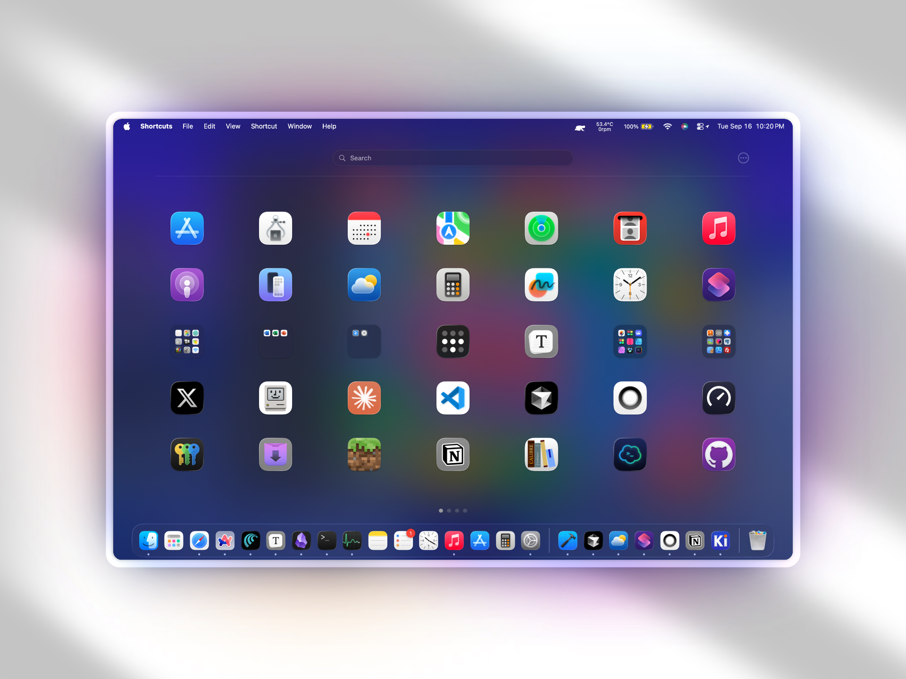

# LaunchNext

**Languages**: [English](README.md) | [中文](i18n/README.zh.md) | [日本語](i18n/README.ja.md) | [Français](i18n/README.fr.md) | [Español](i18n/README.es.md)




MacOS Tahoe removed launchpad,and it's so hard to use, it's doesn't use your Bio GPU, please apple, at least give people an option to switch back. Before that, here is LaunchNext

*Built upon [LaunchNext](https://github.com/ggkevinnnn/LaunchNext) by ggkevinnnn - huge thanks to the original project! I hope this enhanced version can be merged back to the original repository*

*Since the original project has no license specified, the original author is welcome to contact me regarding licensing or any concerns.*

### What LaunchNext Delivers
- ✅ **One-click import from old system Launchpad** - directly reads your native Launchpad SQLite database (`/private$(getconf DARWIN_USER_DIR)com.apple.dock.launchpad/db/db`) to perfectly recreate your existing folders, app positions, and layout
- ✅ **Classic Launchpad experience** - works exactly like the beloved original interface
- ✅ **Hide icon labels** - clean, minimalist view when you don't need app names
- ✅ **Custom icon sizes** - adjust icon dimensions to fit your preferences
- ✅ **Smart folder management** - create and organize folders just like before
- ✅ **Instant search and keyboard navigation** - find apps quickly

### What We Lost in macOS Tahoe
- ❌ No custom app organization
- ❌ No user-created folders
- ❌ No drag-and-drop customization
- ❌ No visual app management
- ❌ Forced categorical grouping


## Features

### 🎯 **Instant App Launch**
- Double-click to launch apps directly
- Full keyboard navigation support
- Lightning-fast search with real-time filtering

### 📁 **Advanced Folder System**
- Create folders by dragging apps together
- Rename folders with inline editing
- Custom folder icons and organization
- Drag apps in and out seamlessly

### 🔍 **Intelligent Search**
- Real-time fuzzy matching
- Search across all installed applications
- Keyboard shortcuts for quick access

### 🎨 **Modern Interface Design**
- **Liquid Glass Effect**: regularMaterial with elegant shadows
- Fullscreen and windowed display modes
- Smooth animations and transitions
- Clean, responsive layouts

### 🔄 **Seamless Data Migration**
- **One-click Launchpad import** from native macOS database
- Automatic app discovery and scanning
- Persistent layout storage via SwiftData
- Zero data loss during system updates

### ⚙️ **System Integration**
- Native macOS application
- Multi-monitor aware positioning
- Works alongside Dock and other system apps
- Background click detection (smart dismissal)

## Technical Architecture

### Built with Modern Technologies
- **SwiftUI**: Declarative, performant UI framework
- **SwiftData**: Robust data persistence layer
- **AppKit**: Deep macOS system integration
- **SQLite3**: Direct Launchpad database reading

### Data Storage
Application data is safely stored in:
```
~/Library/Application Support/LaunchNext/Data.store
```

### Native Launchpad Integration
Reads directly from the system Launchpad database:
```bash
/private$(getconf DARWIN_USER_DIR)com.apple.dock.launchpad/db/db
```

## Installation

### Requirements
- macOS 26 (Tahoe) or later
- Apple Silicon or Intel processor
- Xcode 26 (for building from source)

### Build from Source

1. **Clone the repository**
   ```bash
   git clone https://github.com/yourusername/LaunchNext.git
   cd LaunchNext/LaunchNext
   ```

2. **Open in Xcode**
   ```bash
   open LaunchNext.xcodeproj
   ```

3. **Build and run**
   - Select your target device
   - Press `⌘+R` to build and run
   - Or `⌘+B` to build only

### Command Line Build
```bash
xcodebuild -project LaunchNext.xcodeproj -scheme LaunchNext -configuration Release
```

## Usage

### Getting Started
1. **First Launch**: LaunchNext automatically scans all installed applications
2. **Select**: Click to select apps, double-click to launch
3. **Search**: Type to instantly filter applications
4. **Organize**: Drag apps to create folders and custom layouts

### Import Your Launchpad
1. Open Settings (gear icon)
2. Click **"Import Launchpad"**
3. Your existing layout and folders are automatically imported

### Folder Management
- **Create Folder**: Drag one app onto another
- **Rename Folder**: Click the folder name
- **Add Apps**: Drag apps into folders
- **Remove Apps**: Drag apps out of folders

### Display Modes
- **Windowed**: Floating window with rounded corners
- **Fullscreen**: Full-screen mode for maximum visibility
- Switch modes in Settings

## Project Structure

```
LaunchNext/
├── LaunchpadApp.swift          # Application entry point
├── AppStore.swift              # State management & data
├── LaunchpadView.swift         # Main interface
├── LaunchpadItemButton.swift   # App icon components
├── FolderView.swift           # Folder interface
├── SettingsView.swift         # Settings panel
├── NativeLaunchpadImporter.swift # Data import system
├── Extensions.swift           # Shared utilities
├── Animations.swift           # Animation definitions
├── AppInfo.swift              # App data models
├── FolderInfo.swift           # Folder data models
├── GeometryUtils.swift        # Layout calculations
└── AppCacheManager.swift      # Performance optimization
```

## Why Choose LaunchNext?

### vs. Apple's "Applications" Interface
| Feature | Applications (Tahoe) | LaunchNext |
|---------|---------------------|------------|
| Custom Organization | ❌ | ✅ |
| User Folders | ❌ | ✅ |
| Drag & Drop | ❌ | ✅ |
| Visual Management | ❌ | ✅ |
| Import Existing Data | ❌ | ✅ |
| Performance | Slow | Fast |

### vs. Other Launchpad Alternatives
- **Native Integration**: Direct Launchpad database reading
- **Modern Architecture**: Built with latest SwiftUI/SwiftData
- **Zero Dependencies**: Pure Swift, no external libraries
- **Active Development**: Regular updates and improvements
- **Liquid Glass Design**: Premium visual effects

## Advanced Features

### Smart Background Interaction
- Intelligent click detection prevents accidental dismissal
- Context-aware gesture handling
- Search field protection

### Performance Optimization
- **Icon Caching**: Intelligent image caching for smooth scrolling
- **Lazy Loading**: Efficient memory usage
- **Background Scanning**: Non-blocking app discovery

### Multi-Display Support
- Automatic screen detection
- Per-display positioning
- Seamless multi-monitor workflows

## Known Issues

> **Current Development Status**
> - 🔄 **Scrolling behavior**: Can be unstable in certain scenarios, especially with rapid gestures
> - 🎯 **Folder creation**: Drag-and-drop hit detection for creating folders sometimes inconsistent
> - 🛠️ **Active Development**: These issues are being actively addressed in upcoming releases

## Troubleshooting

### Common Issues

**Q: App won't start?**
A: Ensure macOS 12.0+ and check system permissions.

**Q: Import button missing?**
A: Verify SettingsView.swift includes the import functionality.

**Q: Search not working?**
A: Try rescanning apps or resetting app data in Settings.

**Q: Performance issues?**
A: Check icon cache settings and restart the application.

## Contributing

We welcome contributions! Please:

1. Fork the repository
2. Create a feature branch (`git checkout -b feature/amazing-feature`)
3. Commit changes (`git commit -m 'Add amazing feature'`)
4. Push to branch (`git push origin feature/amazing-feature`)
5. Open a Pull Request

### Development Guidelines
- Follow Swift style conventions
- Add meaningful comments for complex logic
- Test on multiple macOS versions
- Maintain backward compatibility

## The Future of App Management

As Apple moves away from customizable interfaces, LaunchNext represents the community's commitment to user control and personalization. We believe users should decide how to organize their digital workspace.

**LaunchNext** isn't just a Launchpad replacement—it's a statement that user choice matters.

## License

MIT License - see [LICENSE](LICENSE) file for details.

---

**LaunchNext** - Reclaim Your App Launcher 🚀

*Built for macOS users who refuse to compromise on customization.*

## Development Tools

This project was developed with assistance from:

- Claude Code 
- OpenAI Codex Cli