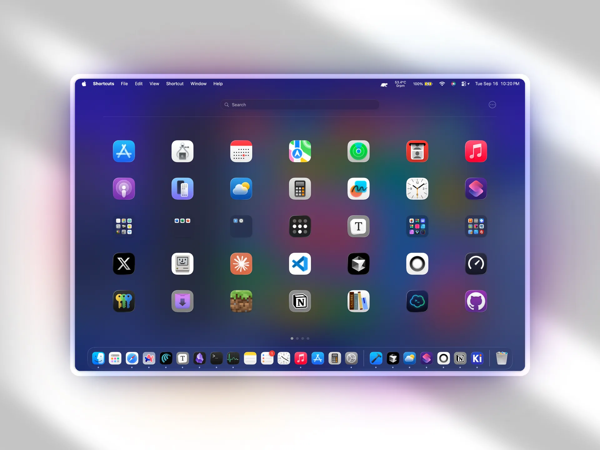
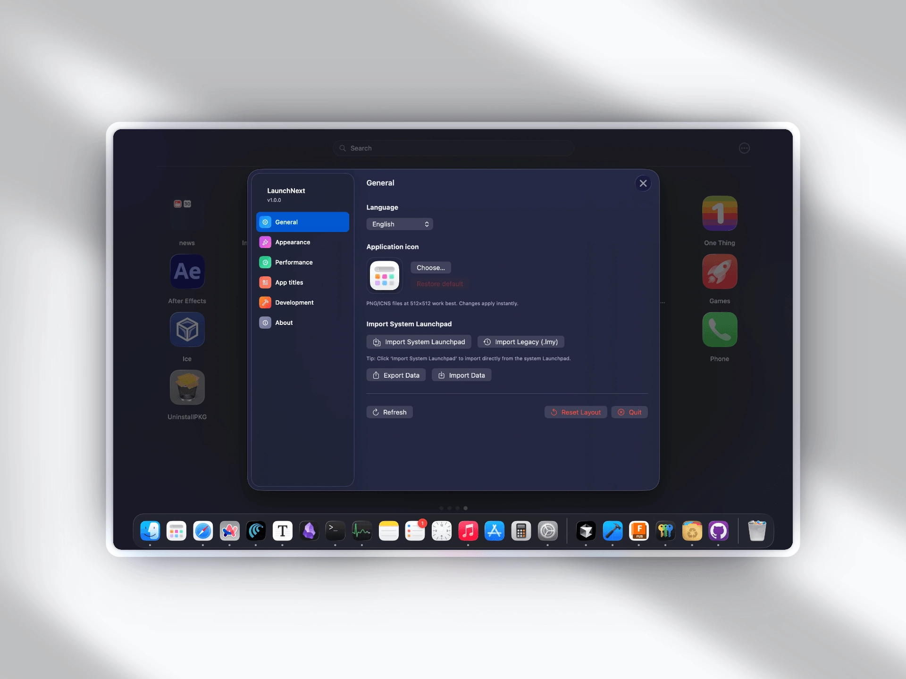
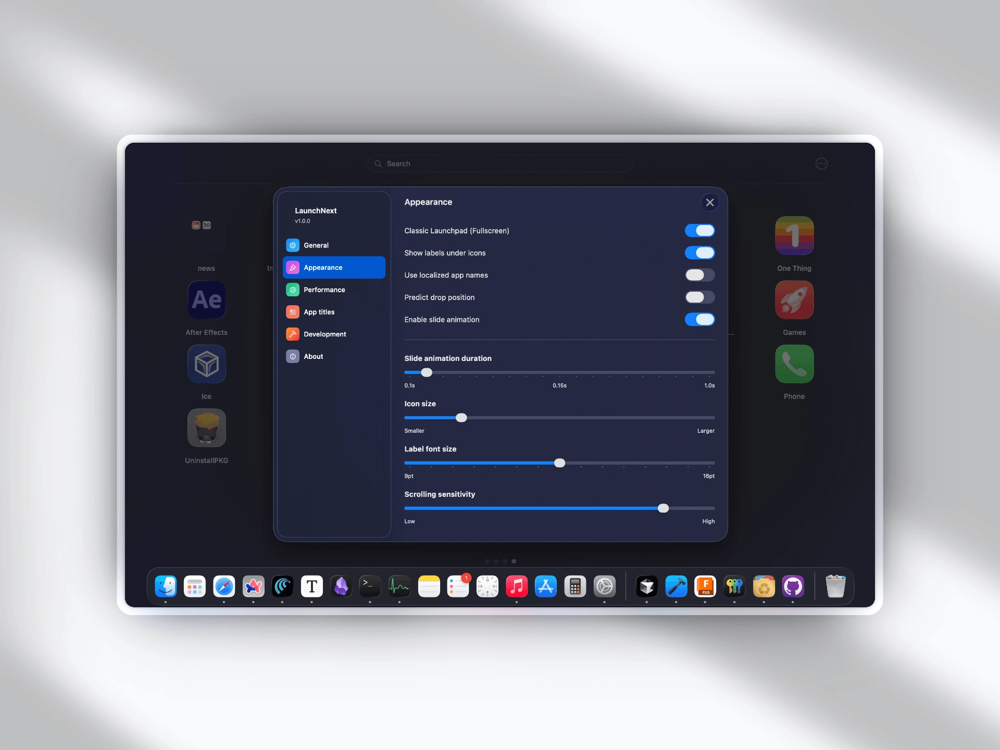
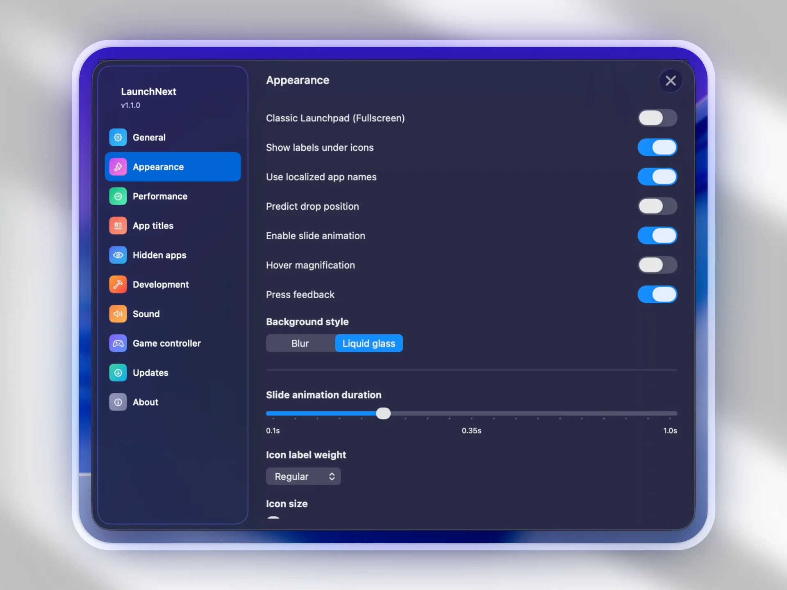

# LaunchNext

**भाषाएँ**: [English](../README.md) | [中文](README.zh.md) | [日本語](README.ja.md) | [Français](README.fr.md) | [Español](README.es.md) | [Deutsch](README.de.md) | [Русский](README.ru.md) | [हिन्दी](README.hi.md)

## 📥 डाउनलोड

**[यहाँ डाउनलोड करें](https://github.com/RoversX/LaunchNext/releases/latest)** - नवीनतम संस्करण प्राप्त करें

⭐ कृपया [LaunchNext](https://github.com/RoversX/LaunchNext) और विशेष रूप से मूल प्रोजेक्ट [LaunchNow](https://github.com/ggkevinnnn/LaunchNow) को स्टार दें!

| | |
|:---:|:---:|
|  |  |
|  |  |

macOS Tahoe ने Launchpad हटा दिया है, और यह इतना उपयोग करना कठिन है, यह आपके Bio GPU का उपयोग नहीं करता। कृपया Apple, कम से कम लोगों को वापस स्विच करने का विकल्प तो दें। उससे पहले, यहाँ है LaunchNext।

*[LaunchNow](https://github.com/ggkevinnnn/LaunchNow) (ggkevinnnn द्वारा) पर आधारित - मूल प्रोजेक्ट के लिए बहुत धन्यवाद! मुझे उम्मीद है कि यह संवर्धित संस्करण मूल रिपॉजिटरी में वापस मर्ज हो सकेगा*

*LaunchNow ने GPL 3 लाइसेंस चुना है। LaunchNext समान लाइसेंसिंग शर्तों का पालन करता है।*

### LaunchNext क्या प्रदान करता है
- ✅ **पुराने सिस्टम Launchpad से वन-क्लिक आयात** - आपके मौजूदा फ़ोल्डर, ऐप स्थितियों और लेआउट को पूर्ण रूप से पुनर्निर्मित करने के लिए सीधे आपके नेटिव Launchpad SQLite डेटाबेस (`/private$(getconf DARWIN_USER_DIR)com.apple.dock.launchpad/db/db`) को पढ़ता है
- ✅ **क्लासिक Launchpad अनुभव** - बिल्कुल पसंदीदा मूल इंटरफ़ेस की तरह काम करता है
- ✅ **बहुभाषी समर्थन** - अंग्रेजी, चीनी, जापानी, फ्रेंच, स्पेनिश, जर्मन, रूसी और हिंदी के साथ पूर्ण अंतर्राष्ट्रीयकरण
- ✅ **आइकन लेबल छुपाएं** - जब आपको ऐप नाम की आवश्यकता नहीं हो तो साफ, न्यूनतम दृश्य
- ✅ **कस्टम आइकन आकार** - अपनी प्राथमिकताओं के अनुसार आइकन आयाम समायोजित करें
- ✅ **स्मार्ट फ़ोल्डर प्रबंधन** - पहले की तरह फ़ोल्डर बनाएं और व्यवस्थित करें
- ✅ **तत्काल खोज और कीबोर्ड नेवीगेशन** - ऐप्स को जल्दी खोजें

### macOS Tahoe में हमने जो खोया
- ❌ कोई कस्टम ऐप संगठन नहीं
- ❌ कोई उपयोगकर्ता-निर्मित फ़ोल्डर नहीं
- ❌ कोई ड्रैग-एंड-ड्रॉप कस्टमाइज़ेशन नहीं
- ❌ कोई विजुअल ऐप प्रबंधन नहीं
- ❌ जबरदस्ती श्रेणीबद्ध समूहीकरण

ध्यान दें कि नीचे दिया गया अधिकांश README Claude AI द्वारा जेनरेट किया गया है, मैंने इसमें नहीं देखा है, कुछ जानकारी सटीक नहीं हो सकती। लेकिन Claude के लिए, आप बिल्कुल सही हैं!

## विशेषताएं

### 🎯 **तुरंत ऐप लॉन्च**
- ऐप्स को सीधे लॉन्च करने के लिए डबल-क्लिक करें
- पूर्ण कीबोर्ड नेवीगेशन समर्थन
- रियल-टाइम फ़िल्टरिंग के साथ बिजली-तेज़ खोज

### 📁 **उन्नत फ़ोल्डर सिस्टम**
- ऐप्स को एक साथ खींचकर फ़ोल्डर बनाएं
- इनलाइन संपादन के साथ फ़ोल्डर का नाम बदलें
- कस्टम फ़ोल्डर आइकन और संगठन
- ऐप्स को निर्बाध रूप से अंदर और बाहर खींचें

### 🔍 **बुद्धिमान खोज**
- रियल-टाइम फ़जी मैचिंग
- सभी इंस्टॉल किए गए एप्लिकेशन में खोजें
- त्वरित पहुंच के लिए कीबोर्ड शॉर्टकट

### 🎨 **आधुनिक इंटरफ़ेस डिज़ाइन**
- **लिक्विड ग्लास इफ़ेक्ट**: सुंदर छायाओं के साथ regularMaterial
- पूर्णस्क्रीन और विंडो डिस्प्ले मोड
- चिकने एनीमेशन और ट्रांज़िशन
- साफ, प्रतिक्रियाशील लेआउट

### 🔄 **निर्बाध डेटा माइग्रेशन**
- नेटिव macOS डेटाबेस से **वन-क्लिक Launchpad आयात**
- स्वचालित ऐप खोज और स्कैनिंग
- SwiftData के माध्यम से निरंतर लेआउट स्टोरेज
- सिस्टम अपडेट के दौरान शून्य डेटा हानि

### ⚙️ **सिस्टम एकीकरण**
- नेटिव macOS एप्लिकेशन
- मल्टी-मॉनिटर अवेयर पोज़िशनिंग
- Dock और अन्य सिस्टम ऐप्स के साथ काम करता है
- बैकग्राउंड क्लिक डिटेक्शन (स्मार्ट डिस्मिसल)

## तकनीकी आर्किटेक्चर

### आधुनिक तकनीकों के साथ निर्मित
- **SwiftUI**: घोषणात्मक, प्रदर्शनकारी UI फ्रेमवर्क
- **SwiftData**: मजबूत डेटा निरंतरता परत
- **AppKit**: गहरा macOS सिस्टम एकीकरण
- **SQLite3**: प्रत्यक्ष Launchpad डेटाबेस रीडिंग

### डेटा स्टोरेज
एप्लिकेशन डेटा सुरक्षित रूप से यहाँ संग्रहीत है:
```
~/Library/Application Support/LaunchNext/Data.store
```

### नेटिव Launchpad एकीकरण
सिस्टम Launchpad डेटाबेस से सीधे पढ़ता है:
```bash
/private$(getconf DARWIN_USER_DIR)com.apple.dock.launchpad/db/db
```

## स्थापना

### आवश्यकताएं
- macOS 26 (Tahoe) या बाद का संस्करण
- Apple Silicon या Intel प्रोसेसर
- Xcode 26 (स्रोत से बिल्ड करने के लिए)

### स्रोत से बिल्ड करें

1. **रिपॉजिटरी क्लोन करें**
   ```bash
   git clone https://github.com/yourusername/LaunchNext.git
   cd LaunchNext/LaunchNext
   ```

2. **Xcode में खोलें**
   ```bash
   open LaunchNext.xcodeproj
   ```

3. **बिल्ड और रन करें**
   - अपना लक्ष्य डिवाइस चुनें
   - बिल्ड और रन करने के लिए `⌘+R` दबाएं
   - या केवल बिल्ड करने के लिए `⌘+B`

### कमांड लाइन बिल्ड

**नियमित बिल्ड:**
```bash
xcodebuild -project LaunchNext.xcodeproj -scheme LaunchNext -configuration Release
```

**यूनिवर्सल बाइनरी बिल्ड (Intel + Apple Silicon):**
```bash
xcodebuild -project LaunchNext.xcodeproj -scheme LaunchNext -configuration Release ARCHS="arm64 x86_64" ONLY_ACTIVE_ARCH=NO clean build
```

## उपयोग

### शुरुआत करना
1. **पहला लॉन्च**: LaunchNext स्वचालित रूप से सभी इंस्टॉल किए गए एप्लिकेशन को स्कैन करता है
2. **चुनें**: ऐप्स चुनने के लिए क्लिक करें, लॉन्च करने के लिए डबल-क्लिक करें
3. **खोजें**: एप्लिकेशन को तुरंत फ़िल्टर करने के लिए टाइप करें
4. **व्यवस्थित करें**: फ़ोल्डर और कस्टम लेआउट बनाने के लिए ऐप्स को खींचें

### अपना Launchpad आयात करें
1. सेटिंग्स खोलें (गियर आइकन)
2. **"Import Launchpad"** पर क्लिक करें
3. आपका मौजूदा लेआउट और फ़ोल्डर स्वचालित रूप से आयात हो जाते हैं

### फ़ोल्डर प्रबंधन
- **फ़ोल्डर बनाएं**: एक ऐप को दूसरे पर खींचें
- **फ़ोल्डर का नाम बदलें**: फ़ोल्डर नाम पर क्लिक करें
- **ऐप्स जोड़ें**: ऐप्स को फ़ोल्डर में खींचें
- **ऐप्स हटाएं**: ऐप्स को फ़ोल्डर से बाहर खींचें

### डिस्प्ले मोड
- **विंडो**: गोल कोनों के साथ फ्लोटिंग विंडो
- **पूर्णस्क्रीन**: अधिकतम दृश्यता के लिए पूर्ण-स्क्रीन मोड
- सेटिंग्स में मोड स्विच करें

## प्रोजेक्ट संरचना

```
LaunchNext/
├── LaunchpadApp.swift          # एप्लिकेशन प्रवेश बिंदु
├── AppStore.swift              # स्टेट मैनेजमेंट और डेटा
├── LaunchpadView.swift         # मुख्य इंटरफ़ेस
├── LaunchpadItemButton.swift   # ऐप आइकन कंपोनेंट्स
├── FolderView.swift           # फ़ोल्डर इंटरफ़ेस
├── SettingsView.swift         # सेटिंग्स पैनल
├── NativeLaunchpadImporter.swift # डेटा आयात सिस्टम
├── Extensions.swift           # साझा उपयोगिताएं
├── Animations.swift           # एनीमेशन परिभाषाएं
├── AppInfo.swift              # ऐप डेटा मॉडल
├── FolderInfo.swift           # फ़ोल्डर डेटा मॉडल
├── GeometryUtils.swift        # लेआउट गणनाएं
└── AppCacheManager.swift      # प्रदर्शन अनुकूलन
```

## LaunchNext क्यों चुनें?

### Apple के "Applications" इंटरफ़ेस बनाम
| विशेषता | Applications (Tahoe) | LaunchNext |
|---------|---------------------|------------|
| कस्टम संगठन | ❌ | ✅ |
| उपयोगकर्ता फ़ोल्डर | ❌ | ✅ |
| ड्रैग एंड ड्रॉप | ❌ | ✅ |
| विजुअल प्रबंधन | ❌ | ✅ |
| मौजूदा डेटा आयात | ❌ | ✅ |
| प्रदर्शन | धीमा | तेज़ |

### अन्य Launchpad विकल्पों बनाम
- **नेटिव एकीकरण**: प्रत्यक्ष Launchpad डेटाबेस रीडिंग
- **आधुनिक आर्किटेक्चर**: नवीनतम SwiftUI/SwiftData के साथ निर्मित
- **शून्य निर्भरताएं**: शुद्ध Swift, कोई बाहरी लाइब्रेरी नहीं
- **सक्रिय विकास**: नियमित अपडेट और सुधार
- **लिक्विड ग्लास डिज़ाइन**: प्रीमियम विजुअल इफ़ेक्ट्स

## उन्नत विशेषताएं

### स्मार्ट बैकग्राउंड इंटरैक्शन
- बुद्धिमान क्लिक डिटेक्शन आकस्मिक बर्खास्तगी को रोकता है
- संदर्भ-जागरूक जेस्चर हैंडलिंग
- सर्च फ़ील्ड सुरक्षा

### प्रदर्शन अनुकूलन
- **आइकन कैशिंग**: स्मूथ स्क्रॉलिंग के लिए बुद्धिमान इमेज कैशिंग
- **लेज़ी लोडिंग**: कुशल मेमोरी उपयोग
- **बैकग्राउंड स्कैनिंग**: नॉन-ब्लॉकिंग ऐप खोज

### मल्टी-डिस्प्ले समर्थन
- स्वचालित स्क्रीन डिटेक्शन
- प्रति-डिस्प्ले पोज़िशनिंग
- निर्बाध मल्टी-मॉनिटर वर्कफ़्लो

## ज्ञात समस्याएं

> **वर्तमान विकास स्थिति**
> - 🔄 **स्क्रॉलिंग व्यवहार**: कुछ परिस्थितियों में अस्थिर हो सकता है, विशेष रूप से तेज़ जेस्चर के साथ
> - 🎯 **फ़ोल्डर निर्माण**: फ़ोल्डर बनाने के लिए ड्रैग-एंड-ड्रॉप हिट डिटेक्शन कभी-कभी असंगत
> - 🛠️ **सक्रिय विकास**: इन समस्याओं को आगामी रिलीज़ में सक्रिय रूप से हल किया जा रहा है

## समस्या निवारण

### सामान्य समस्याएं

**प्र: ऐप शुरू नहीं हो रहा?**
उ: macOS 12.0+ सुनिश्चित करें और सिस्टम अनुमतियों की जांच करें।

**प्र: आयात बटन गायब है?**
उ: सत्यापित करें कि SettingsView.swift में आयात कार्यक्षमता शामिल है।

**प्र: खोज काम नहीं कर रही?**
उ: ऐप्स को फिर से स्कैन करने का प्रयास करें या सेटिंग्स में ऐप डेटा रीसेट करें।

**प्र: प्रदर्शन समस्याएं?**
उ: आइकन कैश सेटिंग्स की जांच करें और एप्लिकेशन को पुनः आरंभ करें।

## योगदान

हम योगदान का स्वागत करते हैं! कृपया:

1. रिपॉजिटरी को फोर्क करें
2. एक फीचर ब्रांच बनाएं (`git checkout -b feature/amazing-feature`)
3. परिवर्तन कमिट करें (`git commit -m 'Add amazing feature'`)
4. ब्रांच में पुश करें (`git push origin feature/amazing-feature`)
5. Pull Request खोलें

### विकास दिशानिर्देश
- Swift स्टाइल कन्वेंशन का पालन करें
- जटिल तर्क के लिए अर्थपूर्ण टिप्पणियां जोड़ें
- कई macOS संस्करणों पर परीक्षण करें
- पिछड़ी संगतता बनाए रखें

## ऐप प्रबंधन का भविष्य

जैसे-जैसे Apple कस्टमाइज़ेबल इंटरफ़ेस से दूर जा रहा है, LaunchNext उपयोगकर्ता नियंत्रण और व्यक्तिगतकरण के लिए समुदाय की प्रतिबद्धता का प्रतिनिधित्व करता है। हम मानते हैं कि उपयोगकर्ताओं को यह तय करना चाहिए कि अपने डिजिटल कार्यक्षेत्र को कैसे व्यवस्थित करना है।

**LaunchNext** केवल Launchpad का प्रतिस्थापन नहीं है—यह एक कथन है कि उपयोगकर्ता की पसंद मायने रखती है।

---

**LaunchNext** - अपना ऐप लॉन्चर वापस पाएं 🚀

*उन macOS उपयोगकर्ताओं के लिए बनाया गया जो कस्टमाइज़ेशन में समझौता करने से इनकार करते हैं।*

## विकास उपकरण

इस प्रोजेक्ट को निम्नलिखित की सहायता से विकसित किया गया:

- Claude Code
- Cursor
- OpenAI Codex Cli